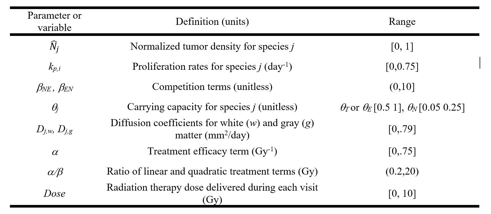

Codes for PINNs (based on Nvidia's Modulus package) for radiation therapy planning using mechanistic models for tumor growth and response to radiation

## Objective

Conventional RT for cancers usually utilizes a single set of imaging acquired prior to the start of treatment and selects a treatment plan that has been shown to work well 
on an ``average patient'' However, cancer is a complex, evolving system that exhibits
significant inter-patient variations that depend on various factors, 
including the underlying genomic instability and tumor microenvironment. 
Physics-informed neural networks (PINNs) are being developed in this repo by integrating 
mechanistic modeling with MRI data to model the spatio-temporal response of 
tumors to RT, to create therapy plans based on individual tumor biology. 

Such a PINN model, trained over a broad range of relevant parameters 
(e.g., diffusion coefficients, tumor proliferation rates, RT dose) and 
regularized/guided using available MRI data, 
can be used to carry out near-instantaneous predictions for the tumor trajectory 
based on parameters corresponding to any new patient, 
thus streamlining RT planning and precluding the need for a huge number of 
parameter-specific computer simulations.

## Steps:

1. View brain cross sections from MRI scans using [view_mat_interactive_all.py](https://github.com/tnnandi/modulus_radiation_therapy/blob/main/view_mat_interactive_all.py) to ensure the geometry is well represented for meshing
2. Generate surface mesh (STL) from the cross sections using [convert_to_stl_surface_use_gmsh_volume.py](https://github.com/tnnandi/modulus_radiation_therapy/blob/main/convert_to_stl_surface_use_gmsh_volume.py) 
3. Generate volume mesh (STL) from the surface mesh using [gmsh](https://gmsh.info/). Generated meshes for a single patient are available at [Box](https://anl.box.com/s/tlyfb74wyuma0jm4zha8zfrwcspxshlb)
4. Edit governing equation/s at [diffusion_proliferation_treatment.py](https://github.com/tnnandi/modulus_radiation_therapy/blob/main/modulus-sym/examples/brain_RT/diffusion_proliferation_treatment.py). Ideally, this should be in /eq/pdes dir, need to fix installation issues within the singularity shell.
4. Execute [brain_param_dose_time.py](https://github.com/tnnandi/modulus_radiation_therapy/blob/main/modulus-sym/examples/brain_RT/brain_param_dose_time.py) using "mpirun -np <num_gpus> python brain_param_D_time.py" to begin PINN training. 
   - Edit the NN configuration, fixed physical properties, ICs/BCs and the parameterized variables as required.
   - The diffusion coefficient is considered as parameterized with values ranging from 0.1 to 0.8 $mm^2/day$.
   - The initial tumor is represented using a gaussian distribution centered around a specific location 

Note: Step 4 needs to be carried out within a singularity shell for Nvidia's Modulus and the STL files need to be placed at the approriate locations 

## Implementation of the governing equations

### Tumor growth equation without the treatment term included
The single-species model for tumor growth is given by:\
$\frac{\partial \hat{N}_T(x,t)}{\partial t} = \nabla \cdot (D_T \nabla \hat{N}_T(x,t)) + \kappa_T\hat{N}_T(x,t)(1 - \frac{\hat{N}_T(x,t)}{\theta_T})$

where the terms on the LHS represented the temporal evolution of the normalized tumor density $\hat{N}$. The first and the second terms on the RHS represent diffusion and proliferation, respectively. 


${N}_T(x,t)$: Normalized tumor density (unitless) \
$D_T$: Tumor cell diffusion coefficient ($mm^2/day$)\
$\kappa_T$: Tumor cell proliferation rate ($day^{-1}$) \
$\theta_T$: Carrying capacity of the tumor (unitless)

### Treatment response model
The response to radiotherapy (RT) and chemotherapy (CT) is modeled as a discrete event:

```math
\hat{N}_{i,\text{post}}(x,t) = \hat{N}_{i,\text{pre}}(x,t) \text{SF}_{\text{RT+CT}}(x,t)$
```
where the surviving fractions of cells due to a single dose of combined radiotherapy and chemotherapy is given by: 

$$
\text{SF}_{\text{RT+CT}}(x,t) = e^{-\alpha \cdot \text{Dose}(x,t) \left(1 + \frac{\text{Dose}(x,t)}{\alpha/\beta} \right)}, 
$$

where $\alpha$ is a treatment sensitivity term, $\text{Dose}(x,t)$ is the dose of RT+CT given in a single fraction, and $\alpha/\beta$ is the ratio of the linear and quadratic sensitivity terms <!-- set to a fixed value of 5.6 Gy. -->

### Modified tumor evolution equation with the treatment term included

The reduction in tumor density due to treatment can be modeled as a decay term proportional to the tumor density and the treatment dose:
```math
\frac{dN_T(x,t)}{dt}\bigg|_{\text{treatment}} = -N_T(x,t) \cdot \alpha \cdot \text{Dose}(x,t) \left(1 + \frac{\text{Dose}(x,t)}{\alpha/\beta}\right)
```

Thus, the full governing equation including the treatment response term is:

```math
\frac{\partial N_T(x,t)}{\partial t} = \nabla \cdot (D_T \nabla N_T(x,t)) + k_p N_T(x,t) \left(1 - \frac{N_T(x,t)}{\theta_T}\right) - \alpha \cdot \text{Dose}(x,t) \left(1 + \frac{\text{Dose}(x,t)}{\alpha/\beta}\right) N_T(x,t)
```
Note 1: Currently, the PINN model is set up with a parameterized treatment response term. The equation is implemented in [diffusion_proliferation_treatment.py](https://github.com/tnnandi/modulus_radiation_therapy/blob/main/modulus-sym/examples/brain_RT/diffusion_proliferation_treatment.py). The dose term is considered as parameterized with values ranging from 0 to 10 $Gy$. 
Training is carried out for temporal evolution over a period of 10 days, where the treatment term is included as a discrete event at the beginning of the third day.

Note 2: Further complexities can be introduced by 
- solving separate transport equations for the enhancing and non-enhancing parts of the tumor withe competition term included 
- making the diffusion coefficient spatially and temporally varying to more accurately represent areas of hypoxia and angiogenesis, and the tumor microenvironment 
## Assignment of physical parameters and the parameterized quantities

List of relevant parameterized quantities and their representative ranges (from David and Caroline)


Currently, the fixed and parameterized quantities are set as follows:

$D_T$:  0.5 $mm^2/day$\
$\kappa_T$: 0.5 $day^{-1}$ \
$\theta_T$: 0.1 \
$\alpha $: 0.5 \
$\frac{\alpha}{\beta}$: 10 

Time: 0 to 10 days \
Dose: 0 to 10 $Gy$ included as a discrete event using a Heaviside function at the beginning of the third day